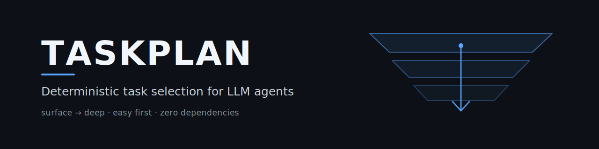

<p align="center">
  
</p>

# taskplan

**Deterministische Aufgabenauswahl für LLM-Agenten.** Keine Abhängigkeiten, nur
Standardbibliothek, Python ≥ 3.10.

*[English version → README.md](README.md)*

Die meisten Agenten-Loops lassen das *Modell* entscheiden, woran es als Nächstes
arbeitet. Das klingt flexibel und scheitert auf eine sehr bestimmte, vorhersagbare
Weise: Das Modell nimmt sich, was am sichtbarsten ist, räumt es auf — und meldet
irgendwann *„nichts mehr zu tun"*, während der eigentliche Rückstand eine
Verzeichnisebene tiefer ungelesen liegt.

taskplan holt diese Entscheidung **aus dem Prompt heraus und in den Code**. Ein
deterministischer Selektor entscheidet, *was* dran ist; beim Modell bleibt das Urteil
(*Ist das leicht? Ist es sicher? Hat es bestanden?*).

---

## Die Regel, die der Selektor durchsetzt

```
  Oberflächen-Durchgang (alle Roots)
    → Tiefgang: LEICHT, in einer Root
    → zurück an die Oberfläche
    → Tiefgang: LEICHT, in der nächsten Root
    → … bis KEINE Root mehr leichte Arbeit hat
    → erst dann: der mittlere Durchgang
```

**Der Aufwand ist die primäre Sortierdimension, die Root-Rotation nur die
sekundäre.** Leichte Aufgaben werden **systemweit** erschöpft, bevor irgendwo eine
mittlere angefasst wird.

Das ist keine Ordnungsliebe. **Leichte Aufgaben entlasten genau die, die anderswo
tief in einem schweren Thema stecken.** Eine liegengebliebene Kleinigkeit in Projekt
A abzuräumen ist mehr wert, als in Projekt B in die Tiefe zu gehen. Genau *dafür*
gibt es die Unterscheidung leicht/mittel überhaupt.

## Gates, die im Code stehen — nicht in Prosa

| Aufwand | Bedeutung | Autonom? |
|---|---|---|
| `easy` | eine oder wenige Dateien, ein Projekt, reversibel, mechanisch prüfbar | **immer** |
| `medium` | mehrere Dateien in **einem** Projekt, kein Architekturwechsel | nur wenn nirgends mehr `easy` offen ist |
| `large` | Architektur, projektübergreifend, Migration | **nie** |
| `special` | braucht Fachwissen, Zugangsdaten oder eine irreversible Aktion | **nie** |
| *(leer)* | unklassifiziert | **gilt nicht als leicht** — lieber liegen lassen als fälschlich für harmlos halten |

`scope = "central"` (geteilte Infrastruktur, auf die andere bauen) ist ebenfalls nie
autonom, unabhängig vom Aufwand.

Ist nichts wählbar, gibt `next_bundle()` **`None`** zurück. Der Loop endet als
**ehrlicher Leerlauf**, statt sich Arbeit zu erfinden, um sich zu füllen.

---

## Schnellstart

```python
from taskplan import api as tasks

tasks.init(agent_id="opus")
tasks.add("Encoding in der Doku korrigieren", priority="high", effort="easy",
          project_path="/repos/foo", root_id="OSS")

for t in tasks.list(effort="easy", scope="local"):
    print(f"[{t['id']}] {t['title']}")

tasks.done(1)
```

Den Selektor fragen:

```bash
python -m taskplan next            # Modus, Aufwand, Projekt, Task-IDs, Rechte
python -m taskplan doctor          # welche Datenbank benutze ich eigentlich?
python -m taskplan projects list   # was sieht der Loop?
python -m taskplan projects markers
```

Exit-Codes von `next`: `0` = Bündel geliefert · `1` = nichts zu tun · `2` = Rolle
abgeschaltet.

### Wer hat es angelegt, wer arbeitet daran

`agent_id` trug früher **drei Bedeutungen zugleich** (Anleger, Bearbeiter, Rolle) und
wurde **beim Zuweisen überschrieben** — die Herkunft war also weg, sobald jemand eine
Aufgabe übernahm. Jetzt sind sie getrennt:

```python
client.add("…")                      # setzt created_by  (unveränderlich)
client.assign(task_id, to="claude")  # setzt assigned_to + delegation_status
```

Wer eine Aufgabe übernimmt, schreibt in `assigned_to` — **niemals** in das Feld, das
die Herkunft trägt.

---

## Drei Rollen

| Rolle | Tut | Tut nie |
|---|---|---|
| **TASKWRITER** | erkennt und formalisiert Aufgaben, **stuft Aufwand/Scope ein** | sie ausführen |
| **TASKSOLVER** | arbeitet ein Bündel ab, prüft es, claimt per `assign()` | das Projekt wählen |
| **MAINTAINER** | hält Dateien und Verzeichnisse sauber, pflegt die Projekterkennung | Aufgaben schreiben oder lösen |

Der Writer ist der Upstream: **Eine uneingestufte Aufgabe ist eine unsichtbare
Aufgabe** — der Solver weigert sich, ihre Größe zu raten.

Die Prompts liegen dem Paket bei (`taskplan.TASKSOLVER`, `.TASKWRITER`,
`.MAINTAINER`) — als Ressourcen, nicht als hartkodierte Strings, und für externe
Starter als echte Dateien auflösbar:

```python
from taskplan import list_workflows, get_workflow_prompt, get_workflow_prompt_path
```

### Sprache der Prompts

Alle drei Rollen liegen auf **Deutsch und Englisch** vor. Der Default ist Englisch —
das Modul soll nutzerneutral sein.

```toml
[language]
prompts = "de"        # de | en
```

Für einen einzelnen Lauf: `TASKPLAN_LANG=de`. Fehlt eine Übersetzung, greift der
englische Fallback — **mit Warnung**. Der Prompt ist der Vertrag der Rolle; ein
stiller Sprachwechsel wäre schlimmer als ein lauter. Tests stellen sicher, dass
**jede Zusage die Übersetzung überlebt** — in beide Richtungen.

---

## Alles konfigurierbar — nichts hartkodiert

Die vollständig kommentierte Fassung: [`taskplan.example.toml`](taskplan.example.toml).

### Speicher

SQLite ist der empfohlene Default — aber der Selektor arbeitet gegen ein schmales
`TaskStore`-Protokoll und **kennt kein SQL**. Ein `files`-Backend belässt die Wahrheit
in den `TODO.md`-Dateien, ganz ohne Datenbank. Fremde Systeme kommen per Entry Point
dazu.

Auflösung: ENV `TASKPLAN_DB` → `taskplan.toml` `[storage].path` → ENV `RINNSAL_DB` →
`~/.taskplan/taskplan.db`.

> `python -m taskplan doctor` **warnt**, wenn die aktive Datenbank leer ist, während
> eine andere Daten enthält. Genau dieser stille Fehler — in eine Datenbank schreiben,
> die niemand liest: kein Absturz, keine Warnung, nur keine Wirkung — ist der Grund,
> warum es ihn gibt.

### Projekterkennung

Fünf Marker-Kategorien, jede einzeln schaltbar, verknüpft mit einem echten booleschen
Ausdruck:

```toml
[traversal.markers]
expression = "(dir_patterns AND files) OR git"   # UND / ODER / NICHT, Klammern
```

| # | Kategorie | Erkennt |
|---|---|---|
| 1 | `dir_patterns` | Muster im Ordnernamen |
| 2 | `files` | Markerdateien (`CLAUDE.md` ist spezifischer als `TODO.md`) |
| 3 | `subdirs` | Marker-Verzeichnisse (`.claude`) |
| 4 | `git` | ein Repository — auch Worktrees/Submodule, wo `.git` eine **Datei** ist |
| 5 | `flag_file` | eine ausdrückliche Markierung; schlägt jede Heuristik |

Der Ausdrucks-Parser ist handgeschrieben, **kein `eval`** — eine Konfigurationsdatei
darf niemals beliebigen Code ausführen. Ein Tippfehler im Markernamen ist ein
**Fehler**, kein stilles „trifft nie"; sonst fände der Loop schweigend gar nichts mehr.

Reicht nicht? `discovery = "manual"` nutzt eine gepflegte Registry statt (oder neben)
der Automatik. Der MAINTAINER hält sie aktuell.

> **Eine Falle, die man kennen sollte — an einem echten System gemessen.**
> Ordnermuster sind mit `combine = "any"` **gefährlich**, wenn die Zwischenebenen
> derselben Konvention folgen wie die Projekte. Kategorien namens `CASH`, `DATA`,
> `CODING` treffen ein Großbuchstaben-Muster genauso wie die Projekte darunter — der
> Scan hält an der Kategorie an und steigt nie ab. Ergebnis: **46 falsche „Projekte"
> statt 91 echter.** `dir_patterns AND files` behebt es. Deshalb steht
> `dir_patterns` per Default auf *aus*.

### Locks — drei Achsen statt eines Schalters

| Aktion | Regel |
|---|---|
| lesen / analysieren | **immer erlaubt** — ein Lock schützt vor *Änderung*, nicht vor *Kenntnisnahme* |
| neue Datei anlegen | in der Regel erlaubt (kollidiert nicht mit Arbeit an bestehenden Dateien) |
| Datei ändern | nur ohne fremden Lock im Scope |

Und entscheidend: **Ein Lock in einem Projekt sperrt dieses Projekt** — nicht seine
Nachbarn und nicht die ganze Pipeline.

Anderes System, anderes Lock-Schema? `provider = "rules"` wertet **nichts** aus — es
reicht die hinterlegten Regeldateien als *Text in den Prompt*. Lieber ein Agent, der
die echte Regel liest, als ein Parser, der ihre Bedeutung errät.

### Rollen, Modelle, Aufgabenquellen, Tiefe

Alles schaltbar. Eine abgeschaltete Rolle **bricht beim Start sauber ab**, statt still
leerzulaufen. `combined = true` führt alle aktiven Rollen in einem Worker aus — so
ergibt `maintainer = false` + `combined = true` einen 2-in-1-Worker, ohne dass es
dafür einen eigenen Modus bräuchte. Die Modellwahl gehört in die Konfiguration, nicht
in den Starter.

---

## Tasks sind keine Tickets

Tasks (dieses Modul) und Tickets (dateibasierte Systeme, IDs wie `T-YYYYMMDD-NN`) sind
**getrennte Systeme**. Tickets *können* zu Tasks führen, müssen aber nicht. Die einzige
Brücke ist `api.add_from_ticket(...)` — sie erzeugt einen ganz normalen Task mit dem
Tag `ticket:<id>`. taskplan importiert, spiegelt und verwaltet keine Tickets.

## Herkunft & Kompatibilität

Dritte Säule der `.MEMORY`-Familie — **USMC** (kuratiertes Session-Memory) ·
**GARDENER** (organisches Memory + Cross-Source-Index) · **TASKPLAN** (Aufgaben).
Extrahiert aus `rinnsal/tasks`; Rinnsal importiert es über einen Seam mit gebündeltem
Fallback zurück.

Der Tabellenname **`rinnsal_tasks` bleibt bewusst erhalten**, und Schema-Änderungen
sind **rein additiv** — bestehende Leser laufen ohne Migration weiter.

Status: `open`, `active`, `done`, `cancelled` · Prioritäten: `critical`, `high`,
`medium`, `low` · Aufwand: `easy`, `medium`, `large`, `special` · Scope: `local`,
`central`.

## Tests

```bash
python -m pytest tests/ -q
```

## Lizenz

MIT — Lukas Geiger
